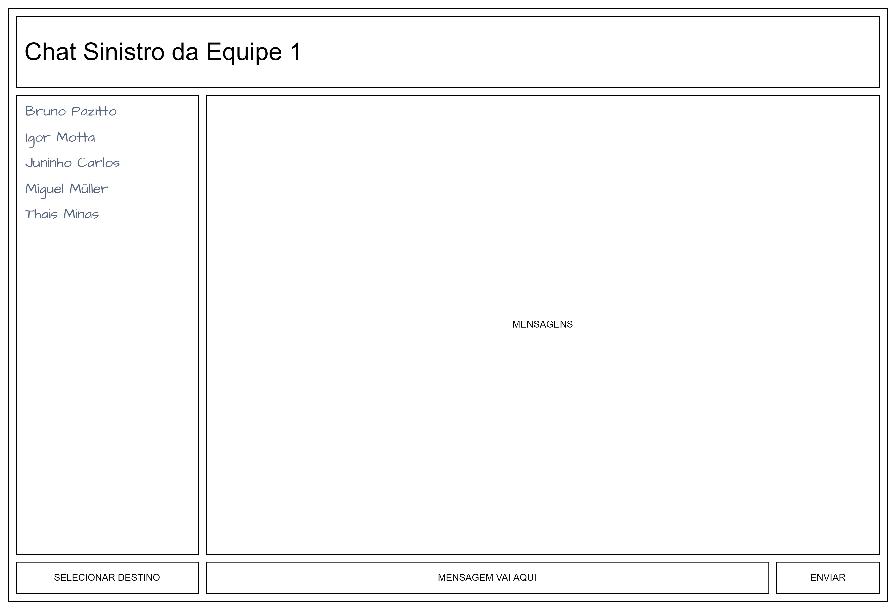
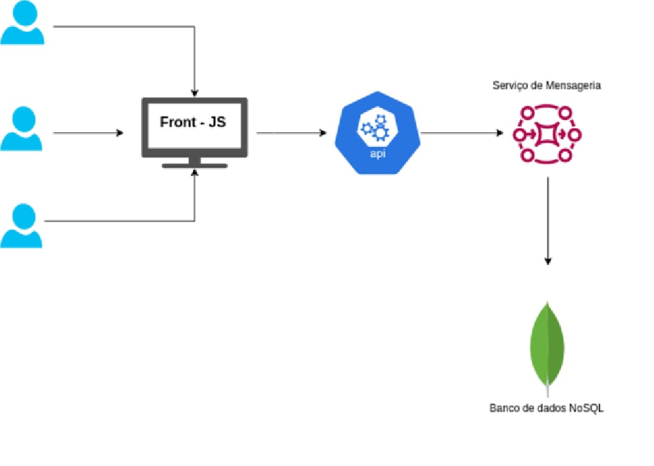

# **Modelagem e Evolução de Chat através da Web**

## **Web 2.0 - Anos 90**
### **Modulos e Fluxo**

### **Protótipo de Baixo Nível**

 

## **Web 3.0 - Anos 2000**

Nossa equipe pensou em fazer atualizações significativas e bem alinhadas com o cenário atual - resumidamente migraríamos a estrutura para uma aplicação em 4 camadas.

- **Camada 1** - App Front-End com utilização de alguma biblioteca/framework javascript. Não definimos qual seria essa ferramenta pois vimos que essa deveria ser uma decisão específica alinhada com outras decisões técnicas que deveriam ser tomadas.

- **Camada 2** - App intermediário servindo com API de integração principalmente para camada 1 e dando possibilidade a um integração com outras soluções que por ventura fossem elaboradas.

- **Camada 3** - Serviço de mensageria, ou message broker, que serviria para implementação de uma arquitetura a eventos e micro-serviços permitindo no futuro a implantação de notificações e envios de emails caso necessário por meio de soluções serverless

- **Camada 4** - Banco de dados que era relacional seria migrado para um banco de dados no-sql em virtude de uma complexidade baixa com relação a estrutura de registros permitindo assim um maior desempenho.

