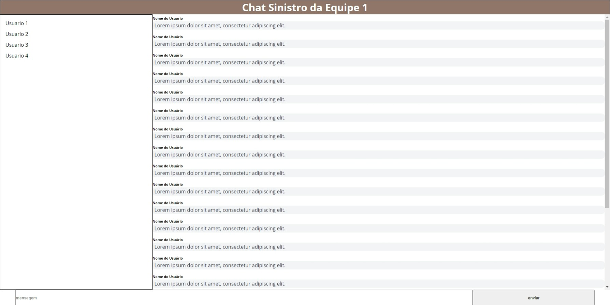

# **Chat - Web 3.0 - Anos 2000**

## **Overview**

Um repositório para o front-end do estudo de chat.

<br/>

## **Consulta a API**

Para efeitos de testes de consulta a API foram feitas usando o serviço: (mocky.io)[https://designer.mocky.io/] de forma que suas respostas foram definidas de acordo com o estabelecido previamente na documentação swagger da API e um exemplo de retorno das requisições foram incluido no arquivo `docs/api.json`.

Para efeitos de acesso pela localhost(servidor local) tivemos que incluir como cabeçalho da API um header extra conforme abaixo:

```
{
    "Access-Control-Allow-Origin": "*"
}
```

## **Executando o projeto**

Certifique-se de que você também tenha o **[NodeJS](https://nodejs.org/)** e o **[NPM](https://www.npmjs.com/)** ou **[Yarn](https://yarnpkg.com/)**instalados em seu computador.

- `$ node --version`
- `$ node --version` ou `$ yarn --version`

<br/>

**Instale as dependências** do projeto com:

- `$ npm install` ou `$ yarn install`

**Visualize** o projeto com:

- `$ npm run view` ou `$ yarn run view`

<br>

## **Screenshot**


